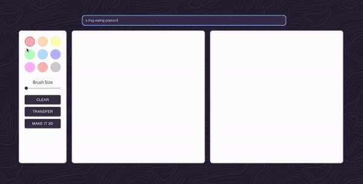

<div align="center">
  
</div>

# Diffusion Canvas

[SDXL Turbo](https://huggingface.co/stabilityai/sdxl-turbo) and [Modal](https://modal.com/) powered realtime image generation via canvas drawings. 

## Local Developement

### File structure

- [frontend](./frontend) - React frontend
- [turbo.py](./turbo.py) - Serverless FastAPI endpoint for served by Modal

### Requirements

1. Install modal and set up locally

```shell
pip install modal
modal setup
```

2. Have [`npm`](https://docs.npmjs.com/downloading-and-installing-node-js-and-npm) installed

### Launch

Serve modal endpoint and retrieve endpoint

```shell
modal serve turbo.py
```

Copy the endpoint from the serve output.  `cd` into the `frontend` directory and make a copy of .env example:

```shell
cp example.env .env
```

Setup endpoint from serce output in .env file and run the app. 

```shell
npm install
npm run start
```

**Note**: The first request will always take a few seconds due to cold starts. 